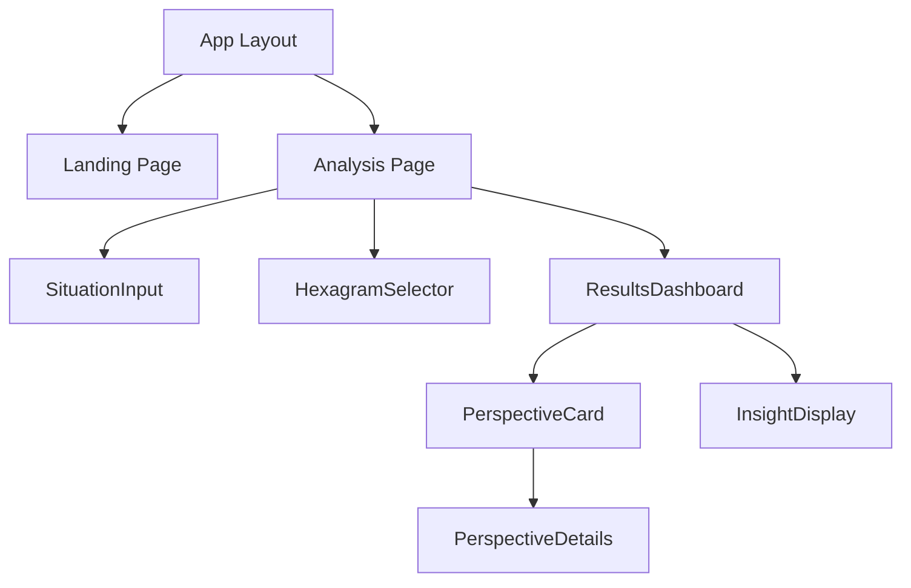

# System Patterns - 시스템 아키텍처 및 설계 패턴

## 🏢 전체 시스템 아키텍처

### 아키텍처 개요
**지혜의 렌즈**는 **완전한 플래시카드 학습 플랫폼**으로 진화한 **전체스텍 Next.js 어플리케이션**입니다. 메인 페이지에서 즉시 64괘 학습을 시작할 수 있는 원스톱 플랫폼입니다.

```
사용자 인터페이스 (React + Tailwind + Three.js)
│
├── 🎴 메인 페이지 (플래시카드 학습 시스템) - 루트 페이지 (/)
├── 📝 기존 텍스트 입력 시스템 (page_old_hexagram_input.tsx - 백업)
├── 🎲 3D 주사위 선택 인터페이스 (/dice-test)
├── AI 해석 및 메모 시스템
├── 상황 입력 인터페이스
├── 결과 표시 대시보드
└── 관점별 상세 뷰
│
Next.js App Router
│
├── /api/hexagrams              ── 64괘 데이터 CRUD
├── /api/flash-card/difficulty  ── 학습 진도 추적 (CORE!)
├── /api/analyze                ── AI 분석 엔진
├── /api/ai/function-calling-test ── Gemini Function-Calling
├── /api/test/user-memo-db      ── 메모 CRUD 시스템 (CORE!)
├── /api/perspectives           ── 6가지 관점 생성
└── /api/sessions               ── 사용자 세션 관리
│
├── Google Gemini API           ── AI 분석 엔진 + Function-Calling
└── MongoDB                     ── 괘 데이터 + 사용자 메모 + 학습 진도 저장소
    ├── hexagrams              ── 64괘 마스터 데이터
    ├── user_memos             ── 사용자 개인 메모 (CORE!)
    └── flash_card_progress    ── 학습 진도 추적 (CORE!)
```

### 레이어 구조
1. **프레젠테이션 레이어** - React 컴포넌트 + Tailwind CSS + Three.js 3D
2. **비즈니스 로직 레이어** - Next.js API Routes + AI 엔진 + Function-Calling
3. **데이터 액세스 레이어** - Mongoose ODM + MongoDB + 메모 시스템
4. **외부 서비스 레이어** - Google Gemini API

## 🎲 3D 주사위 시스템 아키텍처 (NEW!)

### 3D 렌더링 파이프라인
```
Three.js Scene → 8면체 Geometry → 텍스처 매핑 → 애니메이션 → 사용자 인터랙션
│
├── 상괘 주사위 (파란색) ── 8가지 팔괘 상징
├── 하괘 주사위 (빨간색) ── 8가지 팔괘 상징
└── 계산 로직: (상괘-1) × 8 + 하괘 = 64괘 번호
```

### 데이터 통합 플로우
```
3D 주사위 결과 → 괘 번호 계산 → MongoDB 괘 데이터 조회 → AI 해석 요청 → 메모 저장
```

## 📊 데이터 플로우 패턴

### 핵심 데이터 플로우
```mermaid
graph TD
    A[사용자 입력] --> B[/api/analyze]
    B --> C[Gemini AI 요청]
    C --> D[적합 괘 선택]
    D --> E[hexagrams 컴렉션 조회]
    E --> F[6가지 관점 생성]
    F --> G[userSessions 저장]
    G --> H[결과 반환]
    
    I[3D 주사위 선택] --> J[괘 번호 계산]
    J --> K[MongoDB 괘 데이터 조회]
    K --> L[AI Function-Calling 해석]
    L --> M[사용자 메모 저장]
    M --> N[통합 결과 표시]
```

### 데이터 위계 구조
1. **마스터 데이터**: 64괘 기본 정보 (hexagrams)
2. **세션 데이터**: 사용자 분석 결과 (userSessions)
3. **메모 데이터**: 사용자 개인 기록 (user_memos) ← NEW!
4. **임시 데이터**: 메모리 내 AI 처리 결과

## 🧩 핵심 설계 패턴

### 1. 팩토리 패턴 (Factory Pattern)
**용도**: 6가지 관점 생성기
```javascript
// /lib/perspectiveFactory.js
class PerspectiveFactory {
  static createPerspective(type, hexagram, userContext) {
    switch(type) {
      case 'ancient': return new AncientPerspective(hexagram, userContext);
      case 'physics': return new PhysicsPerspective(hexagram, userContext);
      case 'biology': return new BiologyPerspective(hexagram, userContext);
      case 'business': return new BusinessPerspective(hexagram, userContext);
      case 'psychology': return new PsychologyPerspective(hexagram, userContext);
      case 'military': return new MilitaryPerspective(hexagram, userContext);
      default: throw new Error(`Unknown perspective type: ${type}`);
    }
  }
}
```

### 2. 전략 패턴 (Strategy Pattern)
**용도**: AI 맞춤화 전략
```javascript
// /lib/aiStrategies.js
class GeminiAnalysisStrategy {
  async analyze(userSituation, hexagram) {
    // Gemini 특화 분석 로직
    return await this.geminiClient.generateCustomInsight(userSituation, hexagram);
  }
}

class ContextualAnalysis {
  constructor(strategy) {
    this.strategy = strategy;
  }
  
  executeAnalysis(userSituation, hexagram) {
    return this.strategy.analyze(userSituation, hexagram);
  }
}
```

### 3. 옵저버 패턴 (Observer Pattern)
**용도**: 사용자 상호작용 추적
```javascript
// /lib/analytics.js
class UserActivityObserver {
  constructor() {
    this.observers = [];
  }
  
  subscribe(observer) {
    this.observers.push(observer);
  }
  
  notify(event) {
    this.observers.forEach(observer => observer.update(event));
  }
}

// 예시: 세션 저장, 로깅, 분석 등
class SessionTracker {
  update(event) {
    if (event.type === 'perspective_view') {
      this.trackPerspectiveEngagement(event.data);
    }
  }
}
```

### 4. 빌더 패턴 (Builder Pattern)
**용도**: 복합 분석 결과 생성
```javascript
// /lib/responseBuilder.js
class AnalysisResponseBuilder {
  constructor() {
    this.reset();
  }
  
  reset() {
    this.response = {
      hexagram: null,
      perspectives: {},
      metadata: {}
    };
    return this;
  }
  
  setHexagram(hexagram) {
    this.response.hexagram = hexagram;
    return this;
  }
  
  addPerspective(type, content) {
    this.response.perspectives[type] = content;
    return this;
  }
  
  setMetadata(reasoning, confidence) {
    this.response.metadata = { reasoning, confidence };
    return this;
  }
  
  build() {
    return { ...this.response };
  }
}
```

## 📱 컴포넌트 아키텍처

### React 컴포넌트 계층 구조
```
/src/app/
│
├── layout.tsx          ── 글로벌 레이아웃
├── page.tsx            ── 랜딩 페이지
├── analyze/
│   ├── page.tsx        ── 상황 입력 페이지
│   └── results/
│       └── page.tsx    ── 결과 표시 페이지
└── components/
    ├── ui/             ── 기본 UI 컴포넌트
    ├── layout/         ── 레이아웃 컴포넌트
    ├── features/       ── 기능별 컴포넌트
    │   ├── input/      ── 상황 입력 관련
    │   ├── analysis/   ── 분석 결과 관련
    │   └── hexagram/   ── 괘 표시 관련
    └── shared/         ── 공용 컴포넌트
```

### 주요 컴포넌트 관계


### 컴포넌트 설계 원칙
1. **단일 책임 원칙**: 각 컴포넌트는 하나의 명확한 역할
2. **깰누스러운 컴포지션**: 작은 컴포넌트들을 조합하여 복잡한 기능 구성
3. **의존성 역전**: 컴포넌트는 컨크리트가 아닌 추상대상에 의존
4. **상태 끌어올리기**: 공유 상태를 가장 가까운 공통 조상으로

## 🚀 API 설계 패턴

### RESTful API 공통 구조
```javascript
// /src/app/api/*/route.ts 공통 패턴
export async function GET(request: NextRequest) {
  try {
    // 1. 인증 검증
    await validateRequest(request);
    
    // 2. 요청 파라미터 처리
    const params = await parseRequestParams(request);
    
    // 3. 비즈니스 로직 실행
    const result = await executeBusinessLogic(params);
    
    // 4. 응답 형식 통일화
    return NextResponse.json({
      success: true,
      data: result,
      timestamp: new Date().toISOString()
    });
  } catch (error) {
    return handleApiError(error);
  }
}
```

### 핵심 API 엔드포인트 설계

#### 1. /api/hexagrams - 64괘 데이터 API
```javascript
// GET /api/hexagrams - 전체 괘 목록
// GET /api/hexagrams/[id] - 특정 괘 상세
// GET /api/hexagrams/random - 랜덤 괘 선택
// GET /api/hexagrams/search?keyword=창조 - 키워드 검색

// 에러 핸들링 패턴
class ApiErrorHandler {
  static handle(error) {
    if (error instanceof ValidationError) {
      return NextResponse.json({
        success: false,
        error: {
          type: 'VALIDATION_ERROR',
          message: error.message,
          field: error.field
        }
      }, { status: 400 });
    }
    
    if (error instanceof DatabaseError) {
      return NextResponse.json({
        success: false,
        error: {
          type: 'DATABASE_ERROR',
          message: '데이터베이스 오류가 발생했습니다.'
        }
      }, { status: 500 });
    }
  }
}
```

#### 2. /api/analyze - AI 분석 API
```javascript
// POST /api/analyze
// 요청 체
{
  "userSituation": "새로운 사업을 시작할지 고민입니다...",
  "context": {
    "age": 35,
    "profession": "스타트업 대표",
    "priority": "stability"
  }
}

// 응답 체
{
  "success": true,
  "data": {
    "selectedHexagram": {
      "id": "507f1f77bcf86cd799439011",
      "number": 1,
      "name": "중천건",
      "symbol": "☰/☰"
    },
    "reasoning": "AI가 선택한 이유...",
    "confidence": 0.87,
    "sessionId": "uuid-string"
  }
}
```

#### 3. /api/perspectives - 정신모델 격자틀 이론 생성 API
```javascript
// POST /api/perspectives
// 비동기 처리 패턴
async function generatePerspectives(sessionId, hexagram, userContext) {
  const perspectives = ['ancient', 'physics', 'biology', 'business', 'psychology', 'military'];
  
  // 병렬 처리로 성능 최적화
  const results = await Promise.allSettled(
    perspectives.map(async (type) => {
      const perspective = PerspectiveFactory.createPerspective(type, hexagram, userContext);
      return await perspective.generate();
    })
  );
  
  return results.reduce((acc, result, index) => {
    if (result.status === 'fulfilled') {
      acc[perspectives[index]] = result.value;
    } else {
      acc[perspectives[index]] = { error: '관점 생성 실패' };
    }
    return acc;
  }, {});
}
```

## 🎴 메인 페이지 아키텍처 (NEW!)

### 파일 구조 변경
```
/src/app/
├── page.tsx                    ── 플래시카드 학습 시스템 (메인 페이지)
├── page_old_hexagram_input.tsx ── 기존 텍스트 입력 시스템 (백업)
├── card_front.png              ── 카드 앞면 이미지
├── card_back.png               ── 카드 뒷면 이미지
└── test/flash-card/
    ├── page.tsx                ── 원본 플래시카드 페이지 (유지)
    ├── card_front.png          ── 원본 이미지 (유지)
    └── card_back.png           ── 원본 이미지 (유지)
```

### 메인 페이지 컴포넌트 구조
```
HomePage (src/app/page.tsx)
├── 브랜딩 섹션
│   ├── "🎴 지혜의 렌즈" 타이틀
│   ├── "64괘 플래시카드 학습 시스템" 부제
│   └── 사용법 안내
├── 3D 플립 카드 시스템
│   ├── flip-card-front (문제: 괘상, 이름, 핵심관점)
│   └── flip-card-back (답: 요약, 키워드)
├── 학습 상태 표시
│   ├── 현재 난이도 배지
│   └── 개인 메모 섹션
├── 메모 입력/수정 인터페이스
└── 4단계 난이도 평가 버튼
```

### 사용자 접근 패턴
```
사용자 접속 (http://localhost:3000/)
│
├── 즉시 플래시카드 학습 화면 표시
├── 프로젝트 브랜딩 및 설명 확인
├── 사용법 안내 숙지
└── 바로 학습 시작 가능
```

### 메인 페이지 데이터 플로우
```
HomePage 로드
│
├── fetchRandomHexagram() ── /api/hexagrams?random=true
├── fetchHexagramMemoAndProgress() 
│   ├── /api/test/user-memo-db?hexagramNumber=N&username=test
│   └── /api/flash-card/difficulty?username=test&hexagramNumber=N
├── 카드 UI 렌더링
├── 학습 상태 표시
└── 사용자 인터랙션 대기
```


## 🎲 pyproj 점괘 추천 시스템 아키텍처 (NEW! 2025-06-13)

### 시스템 개요
**위치**: `pyproj/` 디렉토리 - 매인 프로젝트와 별도 운영
**목적**: 주역 전통 점사법을 현대적 AI 도구로 구현
**기술 스택**: Python + Streamlit + LangChain + Ollama + MongoDB

### 아키텍처 패턴
```
pyproj/
├── app.py                 ── Streamlit 메인 애플리케이션
├── mongodb.py            ── LangChain + Ollama + MongoDB 연동
├── main.py               ── 엔트리 포인트
├── pyproject.toml        ── 의존성 관리 (uv 기반)
└── uv.lock               ── 의존성 잠금 파일
```

### 데이터 구조 패턴

#### **1️⃣ 괘쌍 관계 매핑**
```python
# 철학적 연결성 및 주제별 흐름
gua_links = {
    # 상경 (대립과 조화)
    11: [12],      # 태(평안) → 비(막힘)
    12: [11],      # 비(막힘) → 태(평안)
    
    # 붕괴와 회복 순환
    23: [24],      # 박(붕괴) → 복(회복)
    24: [25],      # 복(새시작) → 무망(진실)
    
    # 완성과 미완성 순환
    63: [64],      # 기제(완성) → 미제(미완)
    64: [1],       # 미제(미완) → 건(시작)
    # ... 64괘 전체 매핑
}
```

#### **2️⃣ 효변 메커니즘**
```python
# 각 괘별 6효 변화 시 지괘(之卦) 매핑
eff_change_map = {
    1: {  # 건괘 (☰☰)
        1: 44,  # 초괘 변 → 구괘 (만남)
        2: 33,  # 이괘 변 → 둔괘 (물러남)
        3: 12,  # 삼괘 변 → 비괘 (막힘)
        4: 20,  # 사괘 변 → 관괘 (관찰)
        5: 9,   # 오괘 변 → 소축괘 (선비)
        6: 14,  # 상괘 변 → 대유괘 (풍요)
    },
    # ... 전체 64괘 매핑
}
```

### 비즈니스 로직 패턴

#### **변효 수별 해석 원칙**
```python
def get_interpretation_method(changing_lines):
    count = len(changing_lines)
    
    if count == 0:
        return "gua_text"      # 본괘 괘사
    elif count == 1:
        return "line_text"     # 해당 효사
    elif count == 2:
        return "upper_line"    # 위쪽 효사
    elif count == 3:
        return "both_guas"     # 본괘+지괘 종합
    elif count <= 6:
        return "target_gua"    # 지괘 중심
```

#### **다음 괘 추천 로직**
```python
def recommend_next_gua(current_gua, changing_lines=None):
    # 1. 효변이 있으면 지괘 계산
    if changing_lines:
        target_gua = calculate_target_gua(current_gua, changing_lines)
        return {
            "method": "hexagram_change",
            "target": target_gua,
            "interpretation": get_interpretation_method(changing_lines)
        }
    
    # 2. 효변이 없으면 주제적 연결 괘 추천
    linked_guas = gua_links.get(current_gua, [])
    return {
        "method": "thematic_flow",
        "options": linked_guas,
        "interpretation": "philosophical_connection"
    }
```

### UI/UX 패턴

#### **Streamlit 컴포넌트 구조**
```python
# app.py 메인 플로우
1. 타이틀 및 설명
2. 상괘/하괘 선택 (1~8)
3. 괘 번호 계산 표시
4. 효변 선택 (multiselect 1~6) ← NEW!
5. 괘상 시각화 (☰☱☲☳☴☵☶☷) ← NEW!
6. AI 해석 요청 버튼
7. 스트리밍 응답 표시
8. 다음 괘 추천 인터페이스 ← NEW!
```

### 데이터 플로우
```
사용자 입력 (상괘/하괘/효변)
│
├── 괘 번호 계산 (1~64)
├── 효변 유형 분석 (0~6개)
├── 다음 괘 옵션 생성
│   ├── 효변 있음 → 지괘 계산
│   └── 효변 없음 → 주제적 연결
│
└── LLM 프롬프트 생성
    ├── 본괘 상황 분석
    ├── 변화 방향성 해석
    └── 구체적 행동 가이드
```

### 통합 전략
- **매인 프로젝트**: 학습 도구 (Next.js)
- **pyproj**: 실용 점괘 도구 (Python)
- **시너지**: 학습한 괘 지식을 실제 점괘에서 작용
- **데이터 공유**: MongoDB 통합 및 API 연동 가능성

